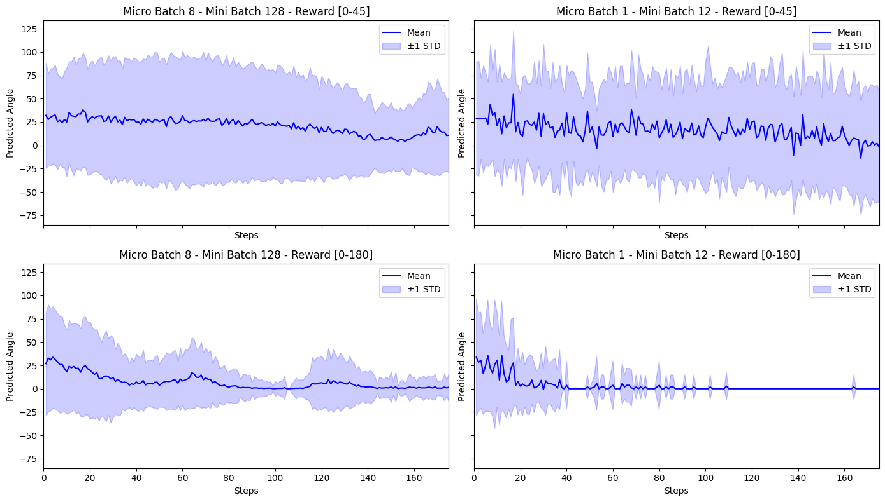
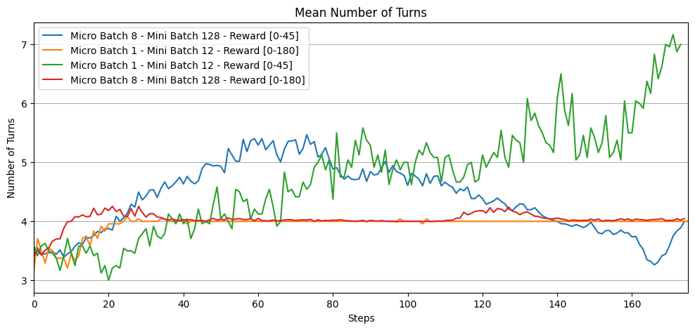
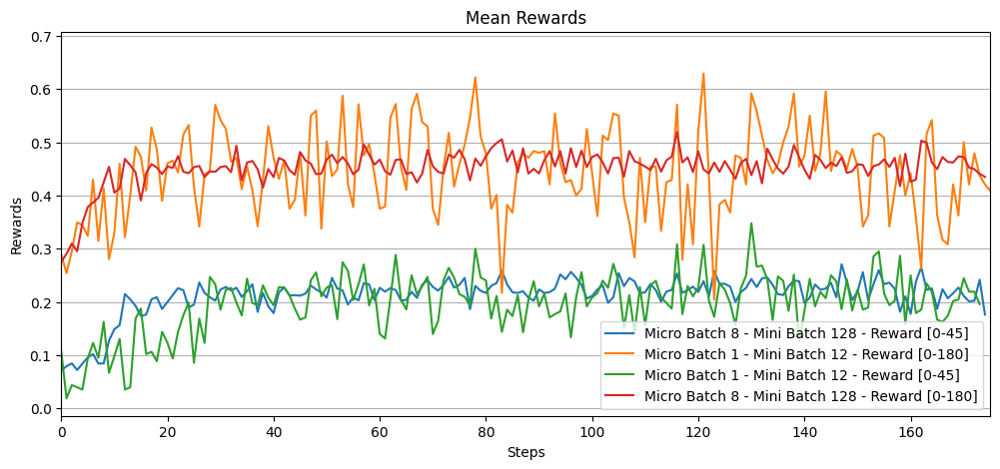

# Setting up the environment
1. Run with the following .toml file:
```
image = "/capstor/store/cscs/swissai/infra01/reasoning/imgs/projects/sgl1/image.sqsh"
mounts = ["/capstor", "/iopsstor", "/users"]
workdir = path_to_verl_repo

[annotations]
com.hooks.aws_ofi_nccl.enabled = "true"
com.hooks.aws_ofi_nccl.variant = "cuda12"
```

2. Create a `.env` file as in `.env.example`, and run `source .env`.
3. Install the necessary packages:
```bash
pip install qwen_vl_utils mathruler math-verify weave gql==3.5.3
pip install -e /capstor/store/cscs/swissai/infra01/reasoning/users/jsaydali/local/decord/python/
export LD_LIBRARY_PATH=/capstor/store/cscs/swissai/infra01/reasoning/users/jsaydali/local/ffmpeg4/lib:$LD_LIBRARY_PATH
```

# Generating Synthetic data
Run the following to generate a random data of images with rotated text and text with varying sizes:
```bash
python data/generate_random_rotations.py --output_dir data/rotations
python data/generate_random_sizes.py --output_dir data/sizes
```

# Training (with rotation tool as an example)
```bash
python3 examples/data_preprocess/custom_multiturn_w_tool_agent_rotate.py  --local_dir="/workspace/verl/data/custom_multiturn_w_tool_rotate"
python3 -c "import transformers; transformers.pipeline(model='Qwen/Qwen2.5-VL-3B-Instruct')"

# otherwise it causes the following error:
# "Please don't set ROCR_VISIBLE_DEVICES when HIP/CUDA_VISIBLE_DEVICES is set."
# at `verl/single_controller/base/worker.py`
unset ROCR_VISIBLE_DEVICES

bash examples/sglang_multiturn/custom/grpo_multimodal_multiturn_rotate.sh
```

# Implemented Tools:
- Drawing bounding boxes: [image_bbox_tool](verl/tools/image_bbox_tool.py)
- Cropping: [image_crop_tool](verl/tools/image_crop_tool.py)
- Flipping: [image_flip_tool](verl/tools/image_flip_tool.py)
- Drawing a line: [image_line_tool](verl/tools/image_line_tool.py)
- Rotation: [image_rotate_tool](verl/tools/image_rotate_tool.py)

1. For each of the tools, add a corresponding data-processing script as in the example of [custom_multiturn_w_tool_agent_rotate.py](examples/data_preprocess/custom_multiturn_w_tool_agent_rotate.py).
2. Change the `actor_rollout_ref.rollout.multi_turn.tool_config_path` argument in the training script to the corresponding [tool config](examples/sglang_multiturn/config/tool_config).

# Adding New Tools:
- Add a script for the new tool under [tools](verl/tools) directory and the tool's config under [tool_config] directory following [this](https://verl.readthedocs.io/en/latest/sglang_multiturn/multiturn.html#custom-tool-configuration).
- A custom reward can be added in [reward_score](verl/utils/reward_score) directory following [this](https://verl.readthedocs.io/en/latest/preparation/reward_function.html).

*Hint: duplicate and modify the above-implemented tools:)*

# Some Results

I trained `Qwen2.5-VL-3B-Instruct` randomly rotated images to predict the rotation angle in multi-turn using `image_rotate_tool`.

**Rewards:**
- [0-180] -> 1 when the angles are equal, decreases linearly with angular error, and becomes 0 when the error reaches 180°
- [0-45] -> 1 when the angles are equal, decreases linearly with angular error, and becomes 0 when the error is above 45°

<div style="display: flex; gap: 20px;">
    
</div>

<div style="display: flex; gap: 20px;">
    
    
</div>

1. With Reward [0-45], the model predicts the angles quite uniformly (+), but using the tool more than once (-).
2. With small batch size, the model learns to use the tool only once, i.e. num_turns=4 (+), but also learns to always predict the average rotation angle (-).
3. Large batch size and Reward [0-45] gives something in between.